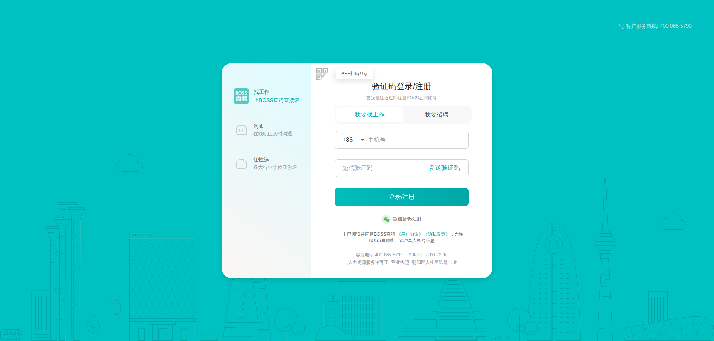
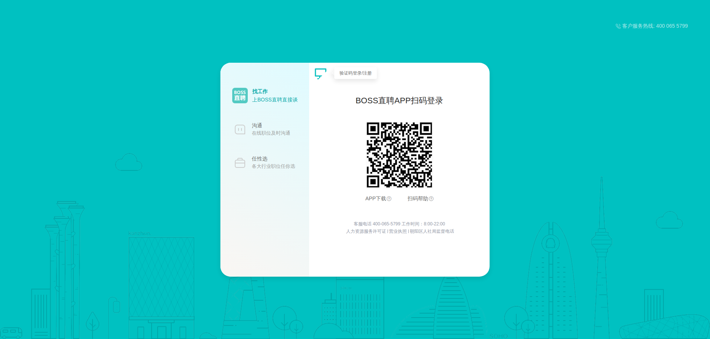
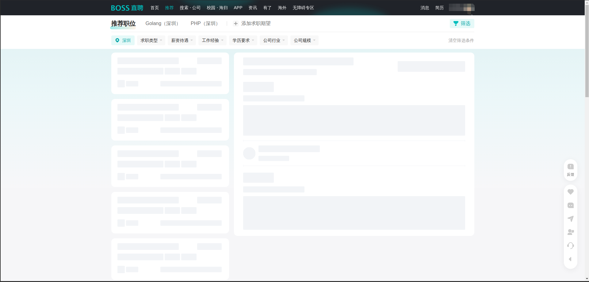
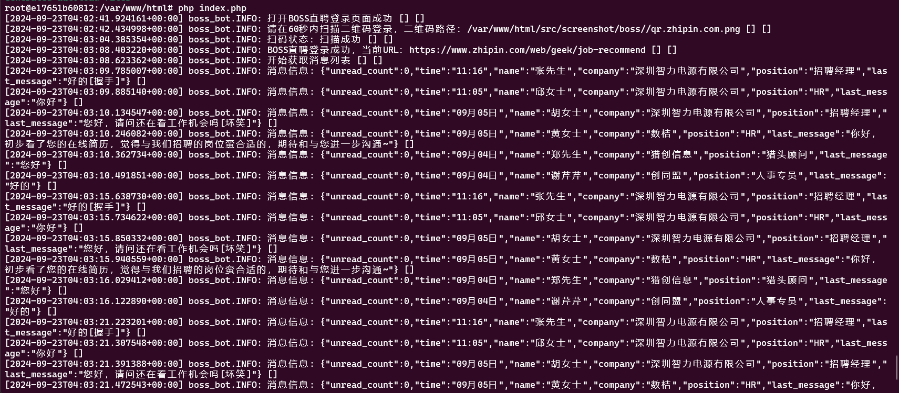

# BOSS直聘自动化机器人

## 项目介绍

BOSS 直聘自动化机器人是一个基于 PHP 的自动化工具，用于模拟用户在 [BOSS](http://zhipin.com) 直聘平台上的操作。它能够自动登录、处理消息，并对未读消息进行自动回复。这个项目使用了 [Symfony Panther](https://github.com/symfony/panther) 和 [php WebDriver](https://github.com/php-webdriver/php-webdriver) 来实现 Web 自动化操作。







### 主要功能

1. 自动打开BOSS直聘登录页面
2. 切换到二维码登录模式
3. 等待用户扫码登录
4. 自动处理收到的消息
5. 对未读消息进行自动回复

### 技术栈

- PHP 8.2
- Git
- Symfony Panther
- Selenium WebDriver
- Docker & Docker Compose
- Monolog (用于日志记录)

## 安装指南

### 前置要求

- Docker 和 Docker Compose
- Git

### 安装步骤

1. 克隆项目仓库：

   ```bash
   git clone [your-repository-url]
   cd boss_bot
   ```
2. 启动 Docker 容器：
   ```
    docker-compose up -d
    ```
3. 进入 PHP 容器：
   ```bash
   docker exec -it boss_bot bash
    ```   
4. 安装依赖：
    ```bash
    composer install
   ```
5. 在 Docker 容器中运行脚本启动机器人
   ```bash
   php index.php
   ```

### 注意事项

本项目仅用于学习和研究目的，请勿用于非法用途。
使用自动化工具可能违反BOSS直聘的使用条款，请谨慎使用。
确保你的网络环境能够正常访问BOSS直聘网站。


### 调试
http://localhost:4444 可以查看自动化构建过程